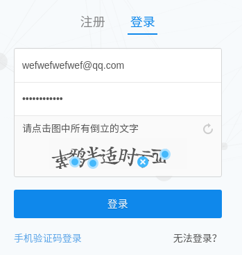

# 项目：huhu

[](https://github.com/hunterhug/huhu/network)
[](https://github.com/hunterhug/huhu/stargazers)
[](https://github.com/hunterhug/huhu)
[](https://goreportcard.com/report/github.com/hunterhug/huhu)
[](https://github.com/hunterhug/huhu/issues)
[](https://raw.githubusercontent.com/hunterhug/huhu/master/LICENSE)


这是一个获取某乎回答的小工具, 可以获取单个问题, 单个收藏夹, 单个人下面的回答, 支持下载图片, 生成HTML离线查看, 工具下载请前往[释出版本二进制](https://github.com/hunterhug/huhu/releases)

目前接口由Golang开发, 实现的API功能可以供外部程序员使用(持续修正)：

Version1支持:

1. 通过单个问题id获取批量答案, 可保存图片和HTML回答
2. 通过集合id获取批量问题后获取批量答案, 可保存图片和HTML回答

Version2支持:

1. 根据用户唯一域名id获取其关注的人，和关注她的人, 导出CSV(已经实现函数, 导出待做!)
2. 获取一个人的所有回答(doing.... )
3. 图片获取使用并发模式, 速度极快

~~鸡肋(不要看):~~

~~5. 关注别人（风险大容易被封杀,建议不要使用）~~

~~6. 登录(本来可以登录，后来某乎加了倒置验证码),该验证码破解较容易~~

~~7. 通过答案id获取单个回答（有点鸡肋，还是写了）~~


## 一.小白使用

See [如何使用](doc/bai.md)

## 二.API说明

此包在哥哥封装的爬虫包基础上开发：[Marmot | Golang Web Spider/Crawler/Scrapy Package](https://github.com/hunterhug/marmot)

```bash
go get -u -v github.com/hunterhug/huhu
```

如果失败请这样:

```
# 在GOPATH路径下新建库路径
mkdir -p $GOPATH/src/github.com/hunterhug

# 下载代码
cd $GOPATH/src/github.com/hunterhug
git clone https://github.com/hunterhug/huhu
```

开始运行main.go, 不同参数如下:

```
# 一般交互模式:

    -c指定cookie文件地址, 默认当前目录
    go run main.go
    go run main.go -c=/home/cookie.txt

# 命令行模式:

    -x  表示采用命令行
    -m  表示模式(目前只支持2:收藏夹)
    -l  表示问题回答限制个数(默认300)
    -i  表示收藏夹ID
    go run main.go -x=1 -m=2 -l=200 -i=78172986
```

二次开发时你只需`import`本包。

```go
import zhihu "github.com/hunterhug/huhu/src"
```

API如下：

1.Cookie相关
```go
// 设置cookie，需传入文件位置，文件中放cookie
func SetCookie(file string) error 
```

2.问题相关
```go
// 构造问题链接，返回url
func Question(id string) string

// 抓答案，需传入限制和页数,每次最多抓20个答案
func CatchAnswer(url string, limit, page int) ([]byte, error)

// 结构化回答，返回一个结构体
func StructAnswer(body []byte) (*Answer, error)
```

3.集合相关
```go
// 抓取收藏夹第几页列表
func CatchCoolection(id, page int) ([]byte, error)

// 抓取全部收藏夹页数,并返回问题ID和标题
func CatchAllCollection(id int) map[string]string 

// 解析收藏夹，返回问题ID和标题
func ParseCollection(body []byte) map[string]string
```

4.工具相关
```go
// 输出HTML选择防盗链方式
func SetPublishToWeb(put bool)

// 输出友好格式HTML，返回问题ID,回答ID，标题，作者，还有HTML
func OutputHtml(answer DataInfo) (qid, aid int, title, who, html string)

// 抓取图片前需要设置true, 后面是并发进程数
func SetSavePicture(catch bool, num int)

// 抓取html中的图片，保存图片在dir下
func SavePicture(dir string, body []byte) 

// 遇到返回的JSON中有中文乱码，请转意
func JsonBack(body []byte) ([]byte, error)

// 设置爬虫调试日志级别，开发可用:debug,info
func SetLogLevel(level string) 

// 设置爬虫暂停时间
func SetWaitTime(w int)
```

5.用户相关
```go
// 关注某人，建议不用
func FollowWho(who string) ([]byte, error) {

// 抓取用户：fensi 抓取你的粉丝，否则，抓取你的偶像，token为用户：如https://www.zhihu.com/people/hunterhug中的hunterhug,limit限制最多20条
func CatchUser(fensi bool, token string, limit, offset int) ([]byte, error) {

// 解析用户
func ParseUser(data []byte) FollowData {
```

6.单用户回答相关

```go
// 获取一个人的一页回答, who为用户标志, 如:da-xiong-nu-da-xiong-nu page为页数
func CatchPeopleAnswer(who string, page int) ([]byte, error){

// 解析获取的回答, 返回的是一个结构体
func ParsePeopleAnswer(data []byte) PeopleAnswerSS {

// 获取一个人的所有回答, 由以上函数封装(内存占用由该用户回答数决定), 返回带有页数的map
func CatchPeopleAllAnswer() map[int]PeopleAnswerSS {
```

7.建议不用API：

```go
// 抓单个答案，需传入问题ID和答案ID 鸡肋功能，弃用！
func CatchOneAnswer(Qid, Aid string) ([]byte, error) {
// 解析单个答案，待完善
func ParseOneAnswer(data []byte) map[string]string {
```

总结, 使用时需要先`SetCookie()`，再根据具体进行开发，使用如下：

```go
package main

import (
	"fmt"
	zhihu "github.com/hunterhug/huhu/src"
	"strings"
)

// API使用说明
func main() {
	//  1. 设置爬虫暂停时间，可选
	zhihu.SetWaitTime(1)

	// 2. 调试模式设置为debug，可选
	zhihu.SetLogLevel("info")

	// 3. 需先传入cookie，必须
	e := zhihu.SetCookie("./cookie.txt")
	if e != nil {
		panic(e.Error())
	}

	// 4.构建问题，url差页数
	q := zhihu.Question("28467579")
	fmt.Println(q)

	// 5.抓取问题回答，按页数，传入页数是为了补齐url，策略是循环抓，直到抓不到可认为页数已完
	page := 1
	limit := 20
	body, e := zhihu.CatchAnswer(q, limit, page)
	if e != nil {
		fmt.Println(e.Error())
		return
	}
	if strings.Contains(string(body), "error") { //可能cookie失效
		b, _ := zhihu.JsonBack(body)
		fmt.Println(string(b))
	}

	// 6.结构化回答
	answers, e := zhihu.StructAnswer(body)
	if e != nil {
		fmt.Println(e.Error())
	} else {
		// 就不打出来了
		//fmt.Printf("%#v\n", answers.Page)
		//fmt.Printf("%#v\n", answers.Data)
	}

	// 7. 选择OutputHtml不要防盗链，因为回答输出的html经过了处理，所以我们进行过滤出好东西
	zhihu.SetPublishToWeb(false)
	qid,aid,t,who,html:=zhihu.OutputHtml(answers.Data[0])
	fmt.Println(qid)
	fmt.Println(aid)
	fmt.Println(t)
	fmt.Println(who)

	// 8. 抓图片, 并发数10
	zhihu.SetSavePicture(false, 10)
	zhihu.SavePicture("test", []byte(html))

	// 9. 抓集合，第2页
	b, e := zhihu.CatchCoolection(78172986, 2)
	if e != nil {
		fmt.Println(e.Error())
	} else {
		// 解析集合
		fmt.Printf("%#v",zhihu.ParseCollection(b))
	}
}
```

登录待破解验证码：

```go
// 登录，验证码突破不了，请采用SetCookie
func Login(email, password string) ([]byte, error)
```



```
_xsrf:2fc4811def8cd9f358465e4ea418b23b
password:z13112502886
captcha:{"img_size":[200,44],"input_points":[[19.2969,28],[40.2969,28],[68.2969,27],[89.2969,31],[112.297,34],[138.297,15],[161.297,27]]}
captcha_type:cn
email:wefwefwefwef@qq.com
```

待收集`https://www.zhihu.com/captcha.gif?r=1497501049814&type=login&lang=cn`进行机器学习！


## 三.编译执行文件方式

```
./build.sh v1
```

如果你觉得项目帮助到你,欢迎请我喝杯咖啡

微信


支付宝


## 四.环境配置

See [环境配置](doc/env.md)

# LICENSE

欢迎加功能(PR/issues),请遵循Apache License协议.

```
Copyright 2017 by huhu author.
Licensed under the Apache License, Version 2.0 (the "License");
you may not use this file except in compliance with the License.
You may obtain a copy of the License at
    http://www.apache.org/licenses/LICENSE-2.0
Unless required by applicable law or agreed to in writing, software
distributed under the License is distributed on an "AS IS" BASIS,
WITHOUT WARRANTIES OR CONDITIONS OF ANY KIND, either express or implied.
See the License for the specific language governing permissions and
limitations under the License
```
