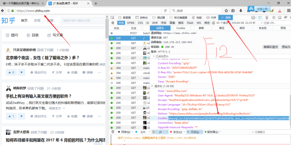
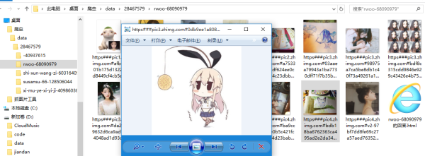
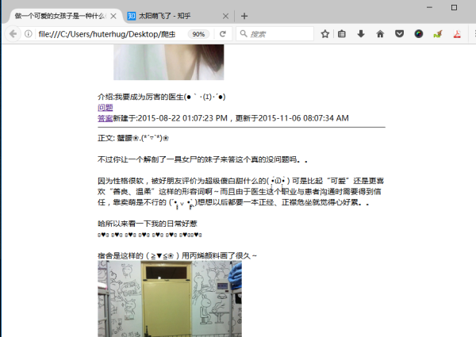

## 一.小白指南

> 可以下载EXE文件

Golang开发的爬虫，小白用户请下载[释出版本二进制](https://github.com/hunterhug/huhu/releases)中的`zhihu_windows_amd64.exe`，并在同一目录下新建一个`cookie.txt`文件，

打开火狐浏览器后人工登录知乎，按F12，点击网络，刷新一下首页，然后点击第一个出现的`GET /`，找到消息头请求头，复制Cookie，然后粘贴到cookie.txt



点击EXE后,可选JS解决防盗链（这个是你要发布到自己的网站如：[减肥成功是什么感觉？给生活带来哪些改变？](http://www.lenggirl.com/zhihu/26613082-html/1.html)）
我们自己本地看的话就不要选择防盗链了！回答个数已经限制不大于500个。如果没有答案证明Cookie失效，请重新按照上述方法手动修改`cookie.txt`。

你也可以全部图片保存在本地, 这样数据会巨大!

```

        -----------------
        知乎问题信息小助手

        支持:
        1. 从收藏夹https://www.zhihu.com/collection/78172986批量获取很多问题答案
        2. 从问题https://www.zhihu.com/question/28853910批量获取一个问题很多答案
        3. 从某个人https://www.zhihu.com/people/hunterhug批量获取粉丝/偶像和所有回答(待做)

        请您按提示操作（Enter）！答案保存在data或者people文件夹下！

        如果什么都没抓到请往exe同级目录cookie.txt,增加cookie，手动增加cookie见说明

        你亲爱的萌萌~ 努力工作中...
        陈白痴~~~

        联系: Github:hunterhug
        QQ: 459527502   Version: 1.1
        2017.6.29 写于大深圳
        -----------------

萌萌：你有几种选项, 你的决定命运着图片链接是否被替换?

        因为知乎防盗链，把生成的HTML放在你的网站上是看不见图片的！

        选项:
        1. N: 不防盗链(默认), 只能本地浏览器查看远程zhihu图片
        2. Y: JS解决防盗链, 引入JS方便查看远程zhihu图片
        3. X: HTML替换本地图片, 图片会保存, 可以永久观看
        4. Z: 打印抓取的问题html

        请选择:
n
萌萌：不试试抓取图片吗Y/N(默认N)
y
萌萌：从收藏夹获取回答按1，从问题获取回答按2(默认)
2
```

选择Z可以打出所有的问题, 汇集`index.html`

结果：





可以看网站 [我的知乎](http://zhihu.lenggirl.com/)


----


收藏夹命令行支持, 可以后台跑!

` ./zhihu_linux_amd64-1.1 --i=61633672 --l=50 --m=2 --x=1 `表示抓取收藏夹61633672下,每个问题抓50个回答, -x表示后台运行(1), -m表示模式(2表示收藏夹,以后会增加....)

Flag way add!

```
Usage of :
  -c string
    	cookie file position (default "cookie.txt")
  -i string
    	id: must be num (default "x")
  -l int
    	limit (default 300)
  -m string
    	catch mode(1:question,2:collect,3) (default "2")
  -x	flag mode

```

we want run in background!

do this: now just support collect:

```
nohup ./zhihu_linux_amd64-1.1 --i=61633672 --l=50 --m=2 --x=1 &
tail -f -n 10 nohup.out
```

总结:
```
# 一般交互模式:

    -c指定cookie文件地址, 默认当前目录
    go run main.go
    go run main.go -c=/home/cookie.txt

# 命令行模式:

    -x  表示采用命令行
    -m  表示模式(目前只支持2:收藏夹)
    -l  表示问题回答限制个数(默认300)
    -i  表示收藏夹ID
    go run main.go -x=1 -m=2 -l=200 -i=78172986
```